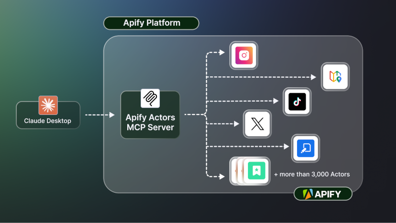

<h1 align="center">
    <a href="https://mcp.apify.com">
        <picture>
            <source media="(prefers-color-scheme: dark)" srcset="docs/apify_mcp_server_dark_background.png">
            
        </picture>
    </a>
    <br>
    <small><a href="https://mcp.apify.com">mcp.apify.com</a></small>
</h1>

<p align=center>
    <a href="https://www.npmjs.com/package/@apify/actors-mcp-server" rel="nofollow"></a>
    <a href="https://www.npmjs.com/package/@apify/actors-mcp-server" rel="nofollow"></a>
    <a href="https://github.com/apify/actors-mcp-server/actions/workflows/check.yaml"></a>
    <a href="https://apify.com/apify/actors-mcp-server"></a>
</p>

The Apify Model Context Protocol (MCP) Server at **mcp.apify.com** instantly connects AI applications and agents to thousands of ready‑built tools. It allows your AI assistant to use any [Apify Actor](https://apify.com/store) for web scraping, data extraction, and automation tasks in real time.

> **🚀 Try the hosted Apify MCP Server!**
>
> For the easiest setup and most powerful features, including the ability to find and use any Actor from Apify Store, connect your AI assistant to our hosted server:
>
> **[`https://mcp.apify.com`](https://mcp.apify.com)**
>
> It supports OAuth, so you can connect from clients like Claude.ai or Visual Studio Code with just the URL.



## Table of Contents
- [🌐 Introducing the Apify MCP server](#-introducing-the-apify-mcp-server)
- [🚀 Quickstart](#-quickstart)
- [🤖 MCP clients and examples](#-mcp-clients-and-examples)
- [🪄 Try Apify MCP instantly](#-try-apify-mcp-instantly)
- [🛠️ Tools, resources, and prompts](#-tools-resources-and-prompts)
- [🐛 Troubleshooting (local MCP server)](#-troubleshooting-local-mcp-server)
- [⚙️ Development](#-development)
- [🤝 Contributing](#-contributing)
- [📚 Learn more](#-learn-more)

# 🌐 Introducing the Apify MCP server

The Apify MCP Server allows an AI assistant to use any [Apify Actor](https://apify.com/store) as a tool to perform a specific task.
For example, it can:
- Use [Facebook Posts Scraper](https://apify.com/apify/facebook-posts-scraper) to extract data from Facebook posts from multiple pages/profiles.
- Use [Google Maps Email Extractor](https://apify.com/lukaskrivka/google-maps-with-contact-details) to extract contact details from Google Maps.
- Use [Google Search Results Scraper](https://apify.com/apify/google-search-scraper) to scrape Google Search Engine Results Pages (SERPs).
- Use [Instagram Scraper](https://apify.com/apify/instagram-scraper) to scrape Instagram posts, profiles, places, photos, and comments.
- Use [RAG Web Browser](https://apify.com/apify/web-scraper) to search the web, scrape the top N URLs, and return their content.

**Video tutorial: Integrate 5,000+ Apify Actors and Agents with Claude**

[](https://www.youtube.com/watch?v=BKu8H91uCTg)

# 🚀 Quickstart

You can use the Apify MCP Server in two ways:

**HTTPS Endpoint (mcp.apify.com)**: Connect from your MCP client via OAuth or by including the `Authorization: Bearer <APIFY_TOKEN>` header in your requests. This is the recommended method for most use cases. Because it supports OAuth, you can connect from clients like [Claude.ai](https://claude.ai) or [Visual Studio Code](https://code.visualstudio.com/) using just the URL: `https://mcp.apify.com`.
- `https://mcp.apify.com` (recommended) for streamable transport
- `https://mcp.apify.com/sse` for legacy SSE transport

**Standard Input/Output (stdio)**: Ideal for local integrations and command-line tools like the Claude for Desktop client.
- Set the MCP client server command to `npx @apify/actors-mcp-server` and the `APIFY_TOKEN` environment variable to your Apify API token.
- See `npx @apify/actors-mcp-server --help` for more options.

You can find detailed instructions for setting up the MCP server in the [Apify documentation](https://docs.apify.com/platform/integrations/mcp).

# 🤖 MCP clients and examples

To interact with the Apify MCP server, you can use various MCP clients, such as:
- [Claude Desktop](https://claude.ai/download)
- [Visual Studio Code](https://code.visualstudio.com/)
- [LibreChat](https://www.librechat.ai/)
- [Apify Tester MCP Client](https://apify.com/jiri.spilka/tester-mcp-client)
- Other clients at [https://modelcontextprotocol.io/clients](https://modelcontextprotocol.io/clients)
- More clients at [https://glama.ai/mcp/clients](https://glama.ai/mcp/clients)

With MCP server integrated, you can ask your AI assistant things like:
- "Search the web and summarize recent trends in AI Agents."
- "Find the top 10 Italian restaurants in San Francisco."
- "Find and analyze the Instagram profile of The Rock."
- "Provide a step-by-step guide on using the Model Context Protocol, including source URLs."
- "What Apify Actors can I use?"

### Supported Clients Matrix

The following table outlines the tested MCP clients and their level of support for key features.

| Client | Dynamic Tool Discovery | Notes |
| --- | --- | --- |
| **Claude.ai (web)** | ✅ Full | |
| **Claude Desktop** | 🟡 Partial | Tools may need to be reloaded manually in the client. |
| **VS Code (Genie)** | ✅ Full | |
| **LibreChat** | ❓ Untested | |
| **Apify Tester MCP Client** | ✅ Full | Designed for testing Apify MCP servers. |

*This matrix is a work in progress. If you have tested other clients, please consider contributing to this documentation.*

# 🪄 Try Apify MCP Instantly

Want to try Apify MCP without any setup?

Check out [Apify Tester MCP Client](https://apify.com/jiri.spilka/tester-mcp-client)

This interactive, chat-like interface provides an easy way to explore the capabilities of Apify MCP without any local setup.
Just sign in with your Apify account and start experimenting with web scraping, data extraction, and automation tools!

# 🛠️ Tools, resources, and prompts

The MCP server provides a set of tools for interacting with Apify Actors.
Since the Apify Store is large and growing rapidly, the MCP server provides a way to dynamically discover and use new Actors.

### Actors

Any [Apify Actor](https://apify.com/store) can be used as a tool.
By default, the server is pre-configured with one Actor, `apify/rag-web-browser`, and several helper tools.
The MCP server loads an Actor's input schema and creates a corresponding MCP tool.
This allows the AI agent to know exactly what arguments to pass to the Actor and what to expect in return.


For example, for the `apify/rag-web-browser` Actor, the input parameters are:

```json
{
  "query": "restaurants in San Francisco",
  "maxResults": 3
}
```
You don't need to manually specify which Actor to call or its input parameters; the LLM handles this automatically.
When a tool is called, the arguments are automatically passed to the Actor by the LLM.
You can refer to the specific Actor's documentation for a list of available arguments.

### Helper tools

One of the most powerful features of using MCP with Apify is dynamic tool discovery.
It gives an AI agent the ability to find new tools (Actors) as needed and incorporate them.
Here are some special MCP operations and how the Apify MCP Server supports them:

- **Actor discovery and management**: Search for Actors, view their details, and dynamically add or remove them as available tools for the AI.
- **Apify documentation**: Search the Apify documentation and fetch specific documents to provide context to the AI.
- **Actor runs (*)**: Get lists of your Actor runs, inspect their details, and retrieve logs.
- **Apify storage (*)**: Access data from your datasets and key-value stores.

**Note**: Helper tool categories marked with (*) are not enabled by default in the MCP server and must be explicitly enabled using the `tools` argument (either the `--tools` command line argument for the stdio server or the `?tools` URL query parameter for the remote MCP server). The `tools` argument is a comma-separated list of categories with the following possible values:

- `docs`: Search and fetch Apify documentation tools.
- `runs`: Get Actor run lists, run details, and logs from a specific Actor run.
- `storage`: Access datasets, key-value stores, and their records.
- `preview`: Experimental tools in preview mode.

For example, to enable all tools, use `npx @apify/actors-mcp-server --tools docs,runs,storage,preview` or `https://mcp.apify.com/?tools=docs,runs,storage,preview`.

### Prompts

The server provides a set of predefined example prompts to help you get started interacting with Apify through MCP. For example, there is a `GetLatestNewsOnTopic` prompt that allows you to easily retrieve the latest news on a specific topic using the [RAG Web Browser](https://apify.com/apify/rag-web-browser) Actor.

### Resources

The server does not yet provide any resources.

### Debugging the NPM package

To debug the server, use the [MCP Inspector](https://github.com/modelcontextprotocol/inspector) tool:

```shell
export APIFY_TOKEN="your-apify-token"
npx @modelcontextprotocol/inspector npx -y @apify/actors-mcp-server
```

# ⚙️ Development

## Prerequisites

- [Node.js](https://nodejs.org/en) (v18 or higher)

Create an environment file, `.env`, with the following content:
```text
APIFY_TOKEN="your-apify-token"
```

Build the `actor-mcp-server` package:

```bash
npm run build
```

## Debugging

Since MCP servers operate over standard input/output (stdio), debugging can be challenging.
For the best debugging experience, use the [MCP Inspector](https://github.com/modelcontextprotocol/inspector).

You can launch the MCP Inspector via [`npm`](https://docs.npmjs.com/downloading-and-installing-node-js-and-npm) with this command:

```bash
export APIFY_TOKEN="your-apify-token"
npx @modelcontextprotocol/inspector node ./dist/stdio.js
```

Upon launching, the Inspector will display a URL that you can open in your browser to begin debugging.

# 🐛 Troubleshooting (local MCP server)

- Make sure you have `node` installed by running `node -v`.
- Make sure the `APIFY_TOKEN` environment variable is set.
- Always use the latest version of the MCP server by using `@apify/actors-mcp-server@latest`.

## 💡 Limitations

The Actor input schema is processed to be compatible with most MCP clients while adhering to [JSON Schema](https://json-schema.org/) standards. The processing includes:
- **Descriptions** are truncated to 500 characters (as defined in `MAX_DESCRIPTION_LENGTH`).
- **Enum fields** are truncated to a maximum combined length of 200 characters for all elements (as defined in `ACTOR_ENUM_MAX_LENGTH`).
- **Required fields** are explicitly marked with a `REQUIRED` prefix in their descriptions for compatibility with frameworks that may not handle the JSON schema properly.
- **Nested properties** are built for special cases like proxy configuration and request list sources to ensure the correct input structure.
- **Array item types** are inferred when not explicitly defined in the schema, using a priority order: explicit type in items > prefill type > default value type > editor type.
- **Enum values and examples** are added to property descriptions to ensure visibility, even if the client doesn't fully support the JSON schema.
- **Rental Actors** are only available for use with the hosted MCP server at https://mcp.apify.com. When running the server locally via stdio, you can only access Actors that are already added to your local toolset. To dynamically search for and use any Actor from the Apify Store—including rental Actors—connect to the hosted endpoint.

# 🤝 Contributing

We welcome contributions to improve the Apify MCP Server! Here's how you can help:

- **🐛 Report issues**: Find a bug or have a feature request? [Open an issue](https://github.com/apify/actors-mcp-server/issues).
- **🔧 Submit pull requests**: Fork the repo and submit pull requests with enhancements or fixes.
- **📚 Documentation**: Improvements to docs and examples are always welcome.
- **💡 Share use cases**: Contribute examples to help other users.

For major changes, please open an issue first to discuss your proposal and ensure it aligns with the project's goals.

# 📚 Learn more

- [Model Context Protocol](https://modelcontextprotocol.org/)
- [What are AI Agents?](https://blog.apify.com/what-are-ai-agents/)
- [What is MCP and why does it matter?](https://blog.apify.com/what-is-model-context-protocol/)
- [How to use MCP with Apify Actors](https://blog.apify.com/how-to-use-mcp/)
- [Tester MCP Client](https://apify.com/jiri.spilka/tester-mcp-client)
- [Webinar: Building and Monetizing MCP Servers on Apify](https://www.youtube.com/watch?v=w3AH3jIrXXo)
- [MCP Client development guide](https://github.com/cyanheads/model-context-protocol-resources/blob/main/guides/mcp-client-development-guide.md)
- [How to build and monetize an AI agent on Apify](https://blog.apify.com/how-to-build-an-ai-agent/)
